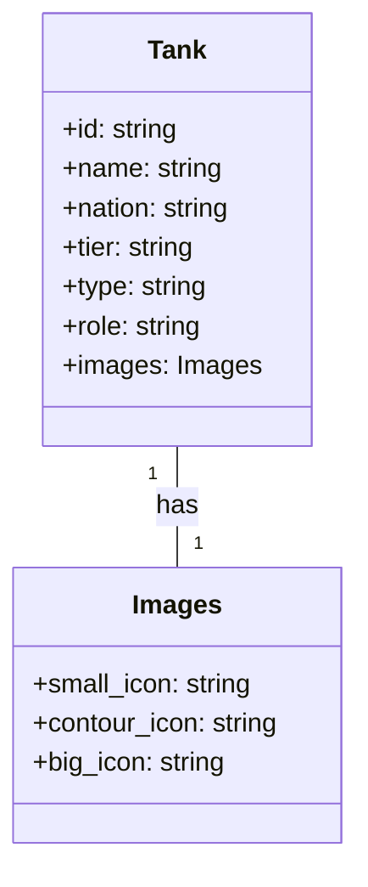

## Diagramas

```mermaid
classDiagram
  class Tank {
    +id: string
    +name: string
    +nation: string
    +tier: string
    +type: string
    +role: string
    +images: Images
  }
  class Images {
    +small_icon: string
    +contour_icon: string
    +big_icon: string
  }
  Tank "1" -- "1" Images : has
```